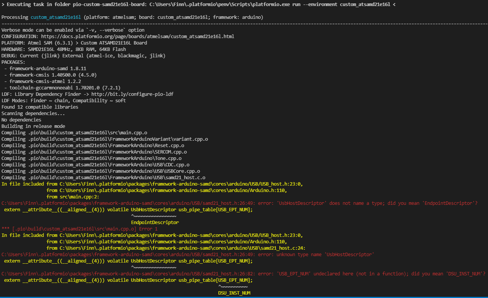

# Custom SAMD21E16L Board Integration for PlatformIO

## Project Status
- I am able to programm the SAMD21E16L via the vendor IDE "Microchip Studio"
- With the cloned project [SAMD21E17A](https://github.com/maxgerhardt/pio-custom-samd21e17a-board) from @maxgerhardt I got parts compiling
- Compiling failed because PIO tries to include USB-libarys which arent declared by the board becaus the microcontroller dont has USB build in.

One of the 33 commands from the `compile_commands.json`
```
"command": "C:\\Users\\Finn\\.platformio\\packages\\toolchain-gccarmnoneeabi@1.70201.0\\bin\\arm-none-eabi-g++.exe -o .pio\\build\\custom_atsamd21e16l\\FrameworkArduino\\Reset.cpp.o -c -fno-rtti -fno-exceptions -std=gnu++11 -fno-threadsafe-statics -Os -ffunction-sections -fdata-sections -Wall -mcpu=cortex-m0plus -mthumb -nostdlib --param max-inline-insns-single=500 -DPLATFORMIO=50101 -DARDUINO_TRINKET_M0 -DCRYSTALLESS -DADAFRUIT_TRINKET_M0 -DARM_MATH_CM0PLUS -D__SAMD21E16L__ -DARDUINO=10805 -DF_CPU=48000000L -DUSBCON -DUSB_VID=0x239A -DUSB_PID=0x801E -DUSB_PRODUCT=\\\"false\\\" -DUSB_MANUFACTURER=\\\"Custom\\\" -DARDUINO_ARCH_SAMD -IC:\\Users\\Finn\\.platformio\\packages\\framework-arduino-samd\\cores\\arduino\\api\\deprecated -IC:\\Users\\Finn\\.platformio\\packages\\framework-arduino-samd\\cores\\arduino\\api\\deprecated-avr-comp -IC:\\Users\\Finn\\.platformio\\packages\\framework-cmsis@1.40500.0\\CMSIS\\Include -IC:\\Users\\Finn\\.platformio\\packages\\framework-cmsis-atmel\\CMSIS\\Device\\ATMEL -IC:\\Users\\Finn\\.platformio\\packages\\framework-arduino-samd\\cores\\arduino -Icustom_arduino_variant\\custom_atsamd21e16l C:\\Users\\Finn\\.platformio\\packages\\framework-arduino-samd\\cores\\arduino\\Reset.cpp",
        "directory": "C:\\Users\\Finn\\Documents\\GitHub\\Positions-Display\\v3\\pio-custom-SAMD21E16L-board",
        "file": "C:\\Users\\Finn\\.platformio\\packages\\framework-arduino-samd\\cores\\arduino\\Reset.cpp"
```

## Possible solution, but I am not capable of
1. Remove USB Libarys from Compiling Queue -> possible due to original board
2. Remove Compile Flags like 
```
-DUSBCON -DUSB_VID=0x239A -DUSB_PID=0x801E -DUSB_PRODUCT=\\\"false\\\" -DUSB_MANUFACTURER=\\\"Custom\\\"
```    

## Installation in PIO
- Background: PIO only partly implements the SAMD21E16L, therefor the is the missing part
- Add under `C:\Users\xx\platformio\packages\framework-cmsis-atmel\CMSIS\Device\ATMEL\samd21\include.samd21.h`  
```
#elif defined(__SAMD21E16L__) || defined(__ATSAMD21E16L__)
  #include "samd21e16l.h"
``` 
- Copy the file `samd21e16l.h` provided in the project under `/backup` to `C:\Users\xx\.platformio\packages\framework-cmsis-atmel\CMSIS\Device\ATMEL\samd21\include`
 **and** `C:\Users\xx\.platformio\packages\framework-cmsis-atmel\CMSIS\Device\ATMEL\samd21\include\pio`
 - Copy the file `ac1.h` provided in the project under `/backup` to `C:\Users\xx\.platformio\packages\framework-cmsis-atmel\CMSIS\Device\ATMEL\samd21\include\instance`
 - Copy the file `tcc_lighting.h` provided in the project under `/backup` to `C:\Users\xx\.platformio\packages\framework-cmsis-atmel\CMSIS\Device\ATMEL\samd21\include\component`

 Files were provided by microchip Studio under `C:\Program Files (x86)\Atmel\Studio\7.0\packs\atmel\SAMD21_DFP\1.3.395\samd21c\include\pio`

---

 ## Description 

Per https://community.platformio.org/t/programm-samd21-directly/18139.

## Opening the project 

Just clone this repository and use the "PIO Home screen" -> "Open Project" method. 

## Configuration

The board's JSON file and `platformio.ini` is already configured for the custom board and an Atmel ICE as upload and debugging tool. 

A custom Arduino variant folder has been created in the `custom_arduino_variant` folder, as a copy and slight modification of the Adafruit Trinket M0. Pin definitions can be expanded or changed at will in the corresponding `variant.cpp`/`variant.h` file. 

The board is assumed to have no crystall oscillator on board and therefore uses the `CRYSTALLESS` macro define in the board definition.

It is assumed that no bootloader is used (like SAM-BA), therefore the board's JSON file specifies `flash_without_bootloader.ld` and an application flash offset of 0.

**Note:** This [community topic](https://community.platformio.org/t/how-to-access-pins-on-samd21-e18a-with-arduino-framework-on-custom-board/18130/2?u=maxgerhardt) shows an example implementation for accessing all pins on an SAMD21E18 chip and may come in handy when adapting it for this chip.
